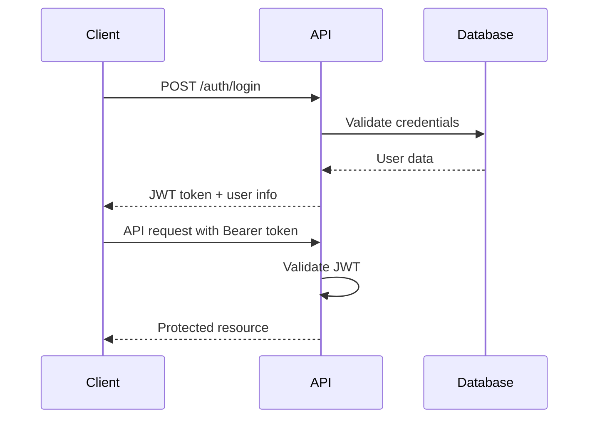

# Authentication API

## Overview

The Ali Tours & Travels API uses JWT (JSON Web Tokens) for authentication. All protected endpoints require a valid Bearer token in the Authorization header.

## Authentication Flow



## Endpoints

### Login

**POST** `/auth/login`

Authenticate a user with email and password.

**Request:**
```json
{
  "email": "user@example.com",
  "password": "password123"
}
```

**Success Response (200):**
```json
{
  "success": true,
  "data": {
    "token": "eyJhbGciOiJIUzI1NiIsInR5cCI6IkpXVCJ9.eyJzdWIiOiJ1c2VyXzEyMyIsImVtYWlsIjoidXNlckBleGFtcGxlLmNvbSIsInJvbGUiOiJ1c2VyIiwiaWF0IjoxNjIxMjM0NTY3LCJleHAiOjE2MjEzMjA5Njd9.signature",
    "refreshToken": "refresh_token_here",
    "user": {
      "id": "user_123",
      "name": "John Doe",
      "email": "user@example.com",
      "role": "user",
      "phone": "+91 9876543210"
    },
    "expiresIn": 86400
  }
}
```

**Error Responses:**

**Invalid Credentials (401):**
```json
{
  "success": false,
  "error": {
    "code": "INVALID_CREDENTIALS",
    "message": "Invalid email or password"
  }
}
```

**Account Locked (423):**
```json
{
  "success": false,
  "error": {
    "code": "ACCOUNT_LOCKED",
    "message": "Account temporarily locked due to multiple failed login attempts",
    "details": {
      "lockUntil": "2024-05-20T12:00:00Z",
      "attemptsRemaining": 0
    }
  }
}
```

### Register

**POST** `/auth/register`

Register a new user account.

**Request:**
```json
{
  "name": "John Doe",
  "email": "user@example.com",
  "password": "password123",
  "phone": "+91 9876543210",
  "address": "123 Main Street, City, State 123456",
  "dateOfBirth": "1990-01-15"
}
```

**Success Response (201):**
```json
{
  "success": true,
  "data": {
    "token": "eyJhbGciOiJIUzI1NiIsInR5cCI6IkpXVCJ9...",
    "user": {
      "id": "user_124",
      "name": "John Doe",
      "email": "user@example.com",
      "role": "user"
    }
  }
}
```

**Error Responses:**

**Email Already Exists (409):**
```json
{
  "success": false,
  "error": {
    "code": "EMAIL_EXISTS",
    "message": "An account with this email already exists"
  }
}
```

**Validation Error (400):**
```json
{
  "success": false,
  "error": {
    "code": "VALIDATION_ERROR",
    "message": "Invalid input data",
    "details": {
      "email": "Invalid email format",
      "password": "Password must be at least 8 characters"
    }
  }
}
```

### Refresh Token

**POST** `/auth/refresh`

Refresh an expired access token.

**Request:**
```json
{
  "refreshToken": "refresh_token_here"
}
```

**Success Response (200):**
```json
{
  "success": true,
  "data": {
    "token": "new_jwt_token_here",
    "expiresIn": 86400
  }
}
```

### Logout

**POST** `/auth/logout`

Invalidate the current session.

**Headers:**
```
Authorization: Bearer <token>
```

**Success Response (200):**
```json
{
  "success": true,
  "message": "Successfully logged out"
}
```

### Get Current User

**GET** `/auth/me`

Get current authenticated user information.

**Headers:**
```
Authorization: Bearer <token>
```

**Success Response (200):**
```json
{
  "success": true,
  "data": {
    "id": "user_123",
    "name": "John Doe",
    "email": "user@example.com",
    "role": "user",
    "phone": "+91 9876543210",
    "createdAt": "2024-01-15T10:30:00Z",
    "lastLoginAt": "2024-05-20T10:30:00Z"
  }
}
```

## Token Structure

JWT tokens contain the following claims:

```json
{
  "sub": "user_123",
  "email": "user@example.com",
  "role": "user",
  "iat": 1621234567,
  "exp": 1621320967
}
```

## Security Best Practices

### Token Storage
- Store tokens securely (httpOnly cookies recommended)
- Never expose tokens in URLs or logs
- Implement token rotation

### Password Requirements
- Minimum 8 characters
- At least one uppercase letter
- At least one lowercase letter
- At least one number
- At least one special character

### Rate Limiting
- Login attempts: 5 per minute per IP
- Registration: 3 per minute per IP
- Token refresh: 10 per minute per user

## Error Codes Reference

| Code | Status | Description |
|------|--------|-------------|
| `INVALID_CREDENTIALS` | 401 | Wrong email or password |
| `ACCOUNT_LOCKED` | 423 | Too many failed login attempts |
| `EMAIL_EXISTS` | 409 | Email already registered |
| `INVALID_TOKEN` | 401 | JWT token is invalid or expired |
| `TOKEN_EXPIRED` | 401 | JWT token has expired |
| `REFRESH_TOKEN_INVALID` | 401 | Refresh token is invalid |
| `VALIDATION_ERROR` | 400 | Request validation failed |
| `RATE_LIMIT_EXCEEDED` | 429 | Too many requests |

## Implementation Examples

### Frontend (React)

```typescript
// auth.service.ts
class AuthService {
  private baseURL = 'https://api.alitourstravels.in/v1';
  
  async login(email: string, password: string) {
    const response = await fetch(`${this.baseURL}/auth/login`, {
      method: 'POST',
      headers: {
        'Content-Type': 'application/json',
      },
      body: JSON.stringify({ email, password }),
    });
    
    const data = await response.json();
    
    if (data.success) {
      localStorage.setItem('token', data.data.token);
      localStorage.setItem('user', JSON.stringify(data.data.user));
    }
    
    return data;
  }
  
  async makeAuthenticatedRequest(endpoint: string, options: RequestInit = {}) {
    const token = localStorage.getItem('token');
    
    return fetch(`${this.baseURL}${endpoint}`, {
      ...options,
      headers: {
        ...options.headers,
        'Authorization': `Bearer ${token}`,
        'Content-Type': 'application/json',
      },
    });
  }
}
```

### Backend (Node.js/Express)

```javascript
// middleware/auth.js
const jwt = require('jsonwebtoken');

const authenticateToken = (req, res, next) => {
  const authHeader = req.headers['authorization'];
  const token = authHeader && authHeader.split(' ')[1];

  if (!token) {
    return res.status(401).json({
      success: false,
      error: {
        code: 'MISSING_TOKEN',
        message: 'Access token is required'
      }
    });
  }

  jwt.verify(token, process.env.JWT_SECRET, (err, user) => {
    if (err) {
      return res.status(401).json({
        success: false,
        error: {
          code: 'INVALID_TOKEN',
          message: 'Invalid or expired token'
        }
      });
    }
    
    req.user = user;
    next();
  });
};

module.exports = { authenticateToken };
```