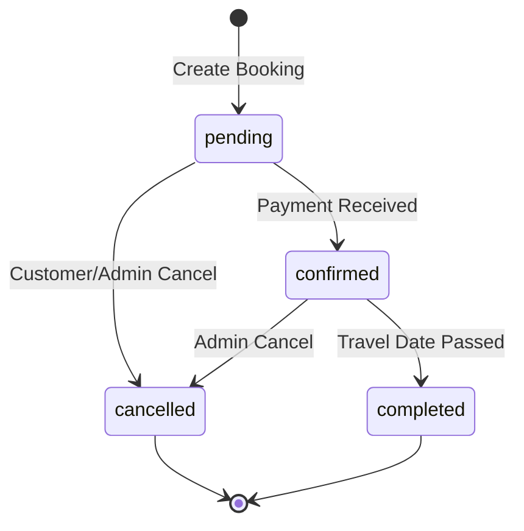

# Bookings API

## Overview

The Bookings API manages tour package reservations, allowing customers to create bookings and admins to manage them throughout the booking lifecycle.

## Endpoints

### Get User Bookings

**GET** `/bookings`

Retrieve bookings for the authenticated user.

**Authentication:** Required

**Query Parameters:**

| Parameter | Type | Description | Example |
|-----------|------|-------------|---------|
| `status` | string | Filter by status | `?status=confirmed` |
| `page` | number | Page number (default: 1) | `?page=2` |
| `limit` | number | Items per page (default: 10) | `?limit=20` |
| `sortBy` | string | Sort field (travelDate, createdAt) | `?sortBy=travelDate` |
| `sortOrder` | string | Sort order (asc, desc) | `?sortOrder=desc` |

**Example Request:**
```bash
GET /bookings?status=confirmed&sortBy=travelDate&sortOrder=asc
```

**Success Response (200):**
```json
{
  "success": true,
  "data": {
    "bookings": [
      {
        "id": "BK1001",
        "packageId": "shimla-explorer",
        "packageName": "Shimla Winter Wonderland",
        "userId": "user_123",
        "userName": "John Doe",
        "email": "user@example.com",
        "phone": "+91 9876543210",
        "travelDate": "2024-06-15T00:00:00Z",
        "guests": 2,
        "totalPrice": 49998,
        "status": "confirmed",
        "specialRequests": "Vegetarian meals preferred",
        "createdAt": "2024-05-20T10:30:00Z",
        "updatedAt": "2024-05-20T11:00:00Z",
        "package": {
          "id": "shimla-explorer",
          "name": "Shimla Winter Wonderland",
          "destination": "Shimla, Himachal Pradesh",
          "image": "https://images.pexels.com/photos/2440024/pexels-photo-2440024.jpeg"
        }
      }
    ],
    "pagination": {
      "page": 1,
      "limit": 10,
      "total": 5,
      "totalPages": 1
    },
    "summary": {
      "totalBookings": 5,
      "upcomingTrips": 2,
      "completedTrips": 3,
      "totalSpent": 249990
    }
  }
}
```

### Get All Bookings (Admin Only)

**GET** `/admin/bookings`

Retrieve all bookings across all customers.

**Authentication:** Admin role required

**Query Parameters:**
- `status` (string): Filter by status
- `packageId` (string): Filter by package
- `customerId` (string): Filter by customer
- `dateFrom` (string): Filter bookings from date (ISO format)
- `dateTo` (string): Filter bookings to date (ISO format)
- `page` (number): Page number
- `limit` (number): Items per page

**Example Request:**
```bash
GET /admin/bookings?status=pending&dateFrom=2024-05-01&dateTo=2024-05-31
```

**Success Response (200):**
```json
{
  "success": true,
  "data": {
    "bookings": [
      {
        "id": "BK1002",
        "packageId": "ladakh-adventure",
        "packageName": "Ladakh Adventure Explorer",
        "userId": "user_124",
        "userName": "Jane Smith",
        "email": "jane@example.com",
        "phone": "+91 9876543211",
        "travelDate": "2024-07-20T00:00:00Z",
        "guests": 4,
        "totalPrice": 143996,
        "status": "pending",
        "paymentStatus": "partial",
        "paidAmount": 71998,
        "remainingAmount": 71998,
        "specialRequests": "Need wheelchair accessible rooms",
        "createdAt": "2024-05-18T14:20:00Z",
        "customer": {
          "id": "user_124",
          "name": "Jane Smith",
          "email": "jane@example.com",
          "phone": "+91 9876543211",
          "totalBookings": 3
        },
        "package": {
          "id": "ladakh-adventure",
          "name": "Ladakh Adventure Explorer",
          "destination": "Leh-Ladakh"
        }
      }
    ],
    "pagination": {
      "page": 1,
      "limit": 10,
      "total": 45,
      "totalPages": 5
    },
    "statistics": {
      "totalBookings": 45,
      "pendingBookings": 12,
      "confirmedBookings": 28,
      "cancelledBookings": 5,
      "totalRevenue": 2250000,
      "averageBookingValue": 50000
    }
  }
}
```

### Create Booking

**POST** `/bookings`

Create a new booking for a tour package.

**Authentication:** Required

**Request Body:**
```json
{
  "packageId": "shimla-explorer",
  "travelDate": "2024-06-15",
  "guests": 2,
  "specialRequests": "Vegetarian meals preferred",
  "contactInfo": {
    "name": "John Doe",
    "email": "john@example.com",
    "phone": "+91 9876543210"
  },
  "passengers": [
    {
      "name": "John Doe",
      "age": 35,
      "gender": "male",
      "idType": "passport",
      "idNumber": "A1234567"
    },
    {
      "name": "Jane Doe",
      "age": 32,
      "gender": "female",
      "idType": "passport",
      "idNumber": "B7654321"
    }
  ]
}
```

**Success Response (201):**
```json
{
  "success": true,
  "data": {
    "id": "BK1003",
    "packageId": "shimla-explorer",
    "packageName": "Shimla Winter Wonderland",
    "travelDate": "2024-06-15T00:00:00Z",
    "guests": 2,
    "totalPrice": 49998,
    "status": "pending",
    "paymentRequired": 24999,
    "paymentDeadline": "2024-05-27T23:59:59Z",
    "createdAt": "2024-05-20T10:30:00Z",
    "confirmationCode": "CONF123456"
  }
}
```

**Error Responses:**

**Package Not Available (409):**
```json
{
  "success": false,
  "error": {
    "code": "PACKAGE_UNAVAILABLE",
    "message": "Package is not available for the selected date",
    "details": {
      "availableDates": ["2024-06-20", "2024-06-25"]
    }
  }
}
```

**Validation Error (400):**
```json
{
  "success": false,
  "error": {
    "code": "VALIDATION_ERROR",
    "message": "Invalid booking data",
    "details": {
      "travelDate": "Travel date must be at least 7 days in the future",
      "guests": "Number of guests exceeds package limit"
    }
  }
}
```

### Get Booking Details

**GET** `/bookings/{id}`

Retrieve detailed information about a specific booking.

**Authentication:** Required (own bookings) or Admin

**Path Parameters:**
- `id` (string, required): Booking ID

**Success Response (200):**
```json
{
  "success": true,
  "data": {
    "id": "BK1001",
    "packageId": "shimla-explorer",
    "packageName": "Shimla Winter Wonderland",
    "userId": "user_123",
    "userName": "John Doe",
    "email": "user@example.com",
    "phone": "+91 9876543210",
    "travelDate": "2024-06-15T00:00:00Z",
    "guests": 2,
    "totalPrice": 49998,
    "status": "confirmed",
    "paymentStatus": "completed",
    "paidAmount": 49998,
    "specialRequests": "Vegetarian meals preferred",
    "passengers": [
      {
        "name": "John Doe",
        "age": 35,
        "gender": "male",
        "idType": "passport",
        "idNumber": "A1234567"
      }
    ],
    "package": {
      "id": "shimla-explorer",
      "name": "Shimla Winter Wonderland",
      "destination": "Shimla, Himachal Pradesh",
      "duration": 5,
      "image": "https://images.pexels.com/photos/2440024/pexels-photo-2440024.jpeg"
    },
    "timeline": [
      {
        "status": "pending",
        "timestamp": "2024-05-20T10:30:00Z",
        "note": "Booking created"
      },
      {
        "status": "confirmed",
        "timestamp": "2024-05-20T11:00:00Z",
        "note": "Payment received and booking confirmed"
      }
    ],
    "createdAt": "2024-05-20T10:30:00Z",
    "updatedAt": "2024-05-20T11:00:00Z"
  }
}
```

### Update Booking Status (Admin Only)

**PATCH** `/bookings/{id}/status`

Update the status of a booking.

**Authentication:** Admin role required

**Path Parameters:**
- `id` (string, required): Booking ID

**Request Body:**
```json
{
  "status": "confirmed",
  "note": "Payment verified and booking confirmed"
}
```

**Success Response (200):**
```json
{
  "success": true,
  "data": {
    "id": "BK1001",
    "status": "confirmed",
    "updatedAt": "2024-05-20T11:00:00Z"
  }
}
```

### Cancel Booking

**PATCH** `/bookings/{id}/cancel`

Cancel a booking (customer or admin).

**Authentication:** Required (own booking) or Admin

**Request Body:**
```json
{
  "reason": "Change in travel plans",
  "refundRequested": true
}
```

**Success Response (200):**
```json
{
  "success": true,
  "data": {
    "id": "BK1001",
    "status": "cancelled",
    "cancellationDetails": {
      "reason": "Change in travel plans",
      "cancelledAt": "2024-05-20T11:00:00Z",
      "refundAmount": 37498,
      "refundStatus": "processing"
    }
  }
}
```

## Booking Status Flow



## Validation Rules

### Booking Creation

| Field | Type | Required | Validation |
|-------|------|----------|------------|
| `packageId` | string | Yes | Must exist and be active |
| `travelDate` | string | Yes | ISO date, min 7 days future |
| `guests` | number | Yes | 1 <= guests <= package.maxGuests |
| `specialRequests` | string | No | Max 500 characters |
| `passengers` | array | Yes | Length must equal guests |

### Passenger Information

| Field | Type | Required | Validation |
|-------|------|----------|------------|
| `name` | string | Yes | 2-50 characters |
| `age` | number | Yes | 0-120 |
| `gender` | string | Yes | male, female, other |
| `idType` | string | Yes | passport, aadhar, pan |
| `idNumber` | string | Yes | Valid format per ID type |

## Business Rules

### Booking Policies

1. **Advance Booking**: Minimum 7 days before travel
2. **Payment Terms**: 50% advance, balance before travel
3. **Cancellation**: 
   - 15+ days: 90% refund
   - 7-14 days: 75% refund
   - 3-6 days: 50% refund
   - <3 days: No refund
4. **Group Discounts**: 10% off for 6+ people
5. **Seasonal Pricing**: Peak season surcharge may apply

### Availability Rules

1. **Package Capacity**: Limited by maxGuests per departure
2. **Blackout Dates**: Some packages unavailable on certain dates
3. **Weather Restrictions**: Mountain packages may be cancelled due to weather